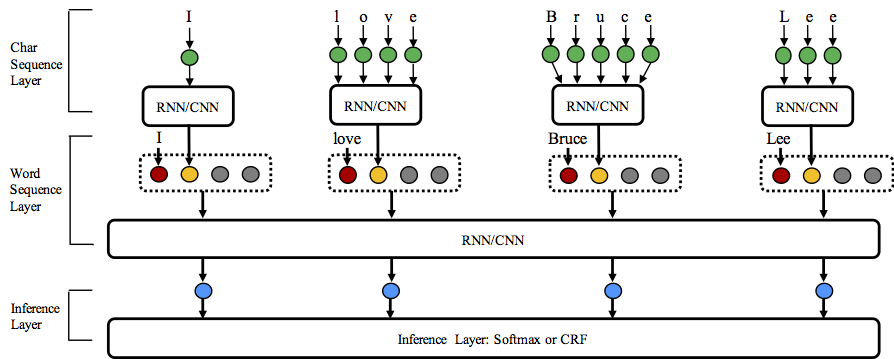
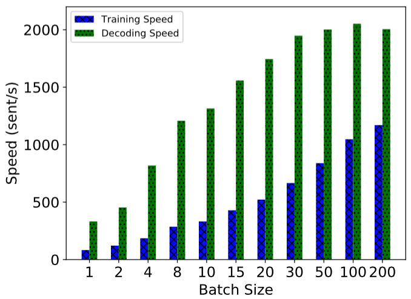
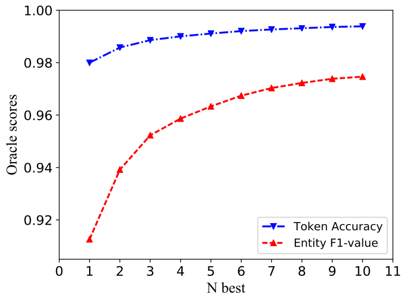

# NCRF++: An Open-source Neural Sequence Labeling Toolkit


* [1. Introduction](#Introduction)
* [2. Requirement](#Requirement)
* [3. Advantages](#Advantages)
* [4. Usage](#Usage)
* [5. Data Format](#Data-Format)
* [6. Performance](#Performance)
* [7. Add Handcrafted Features](#Add-Handcrafted-Features)
* [8. Speed](#Speed)
* [9. N best Decoding](#N-best-Decoding)
* [10. Reproduce Paper Results and Hyperparameter Tuning](#Reproduce-Paper-Results-and-Hyperparameter-Tuning)
* [11. Report Issue or Problem](#Report-Issue-or-Problem)
* [12. Cite](#Cite)
* [13. Future Plan](#Future-Plan)
* [13. Update](#Update)

## Introduction

Sequence labeling models are quite popular in many NLP tasks, such as Named Entity Recognition (NER), part-of-speech (POS) tagging and word segmentation. State-of-the-art sequence labeling models mostly utilize the CRF structure with input word features. LSTM (or bidirectional LSTM) is a popular deep learning based feature extractor in sequence labeling task. And CNN can also be used due to faster computation. Besides, features within word are also useful to represent word, which can be captured by character LSTM or character CNN structure or human-defined neural features.

NCRF++ is a PyTorch based framework with flexiable choices of input features and output structures. The design of neural sequence labeling models with NCRF++ is fully configurable through a configuration file, which does not require any code work. NCRF++ can be regarded as a neural network version of [CRF++](http://taku910.github.io/crfpp/), which is a famous statistical CRF framework. 

This framework has been accepted by [ACL 2018](https://arxiv.org/abs/1806.05626) as demonstration paper. And the detailed experiment report and analysis using NCRF++ has been accepted at [COLING 2018](https://arxiv.org/abs/1806.04470) as the best paper.

NCRF++ supports different structure combinations of on three levels: character sequence representation, word sequence representation and inference layer.

* Character sequence representation: character LSTM, character GRU, character CNN and handcrafted word features.
* Word sequence representation: word LSTM, word GRU, word CNN.
* Inference layer: Softmax, CRF.

Welcome to star this repository!

## Requirement

	Python: 2 or 3  
	PyTorch: 1.0 

[PyTorch 0.3 compatible version is here.](https://github.com/jiesutd/NCRFpp/tree/PyTorch0.3)


## Advantages

* Fully configurable: all the neural model structures can be set with a configuration file.
* State-of-the-art system performance: models build on NCRF++ can give comparable or better results compared with state-of-the-art models.
* Flexible with features: user can define their own features and pretrained feature embeddings.
* Fast running speed: NCRF++ utilizes fully batched operations, making the system efficient with the help of GPU (>1000sent/s for training and >2000sents/s for decoding).
* N best output: NCRF++ support `nbest` decoding (with their probabilities).


## Usage

NCRF++ supports designing the neural network structure through a configuration file. The program can run in two status; ***training*** and ***decoding***. (sample configuration and data have been included in this repository)  

In ***training*** status:
`python main.py --config demo.train.config`

In ***decoding*** status:
`python main.py --config demo.decode.config`

The configuration file controls the network structure, I/O, training setting and hyperparameters. 

***Detail configurations and explanations are listed [here](readme/Configuration.md).***

NCRF++ is designed in three layers (shown below): character sequence layer; word sequence layer and inference layer. By using the configuration file, most of the state-of-the-art models can be easily replicated ***without coding***. On the other hand, users can extend each layer by designing their own modules (for example, they may want to design their own neural structures other than CNN/LSTM/GRU). Our layer-wised design makes the module extension convenient, the instruction of module extension can be found [here](readme/Extension.md).




## Data Format

* You can refer the data format in [sample_data](sample_data). 
* NCRF++ supports both BIO and BIOES(BMES) tag scheme.  
* Notice that IOB format (***different*** from BIO) is currently not supported, because this tag scheme is old and works worse than other schemes [Reimers and Gurevych, 2017](https://arxiv.org/pdf/1707.06799.pdf). 
* The difference among these three tag schemes is explained in this [paper](https://arxiv.org/pdf/1707.06799.pdf).
* I have written a [script](utils/tagSchemeConverter.py) which converts the tag scheme among IOB/BIO/BIOES. Welcome to have a try. 


## Performance

Results on CONLL 2003 English NER task are better or comparable with SOTA results with the same structures. 

CharLSTM+WordLSTM+CRF: 91.20 vs 90.94 of [Lample .etc, NAACL16](http://www.aclweb.org/anthology/N/N16/N16-1030.pdf);

CharCNN+WordLSTM+CRF:  91.35 vs 91.21 of [Ma .etc, ACL16](http://www.aclweb.org/anthology/P/P16/P16-1101.pdf).   

By default, `LSTM` is bidirectional LSTM.    

|ID| Model | Nochar | CharLSTM |CharCNN   
|---|--------- | --- | --- | ------    
|1| WordLSTM | 88.57 | 90.84 | 90.73  
|2| WordLSTM+CRF | 89.45 | **91.20** | **91.35** 
|3| WordCNN |  88.56| 90.46 | 90.30  
|4| WordCNN+CRF |  88.90 | 90.70 | 90.43  

We have compared twelve neural sequence labeling models (`{charLSTM, charCNN, None} x {wordLSTM, wordCNN} x {softmax, CRF}`) on three benchmarks (POS, Chunking, NER) under statistical experiments, detail results and comparisons can be found in our COLING 2018 paper [Design Challenges and Misconceptions in Neural Sequence Labeling](https://arxiv.org/abs/1806.04470).
 

## Add Handcrafted Features

NCRF++ has integrated several SOTA neural characrter sequence feature extractors: CNN ([Ma .etc, ACL16](http://www.aclweb.org/anthology/P/P16/P16-1101.pdf)), LSTM ([Lample .etc, NAACL16](http://www.aclweb.org/anthology/N/N16/N16-1030.pdf)) and GRU ([Yang .etc, ICLR17](https://arxiv.org/pdf/1703.06345.pdf)). In addition, handcrafted features have been proven important in sequence labeling tasks. NCRF++ allows users designing their own features such as Capitalization, POS tag or any other features (grey circles in above figure). Users can configure the self-defined features through configuration file (feature embedding size, pretrained feature embeddings .etc). The sample input data format is given at [train.cappos.bmes](sample_data/train.cappos.bmes), which includes two human-defined features `[POS]` and `[Cap]`. (`[POS]` and `[Cap]` are two examples, you can give your feature any name you want, just follow the format `[xx]` and configure the feature with the same name in configuration file.)
User can configure each feature in configuration file by using 

```Python
feature=[POS] emb_size=20 emb_dir=%your_pretrained_POS_embedding
feature=[Cap] emb_size=20 emb_dir=%your_pretrained_Cap_embedding
```

Feature without pretrained embedding will be randomly initialized.


## Speed

NCRF++ is implemented using fully batched calculation, making it quite effcient on both model training and decoding. With the help of GPU (Nvidia GTX 1080) and large batch size, LSTMCRF model built with NCRF++ can reach 1000 sents/s and 2000sents/s on training and decoding status, respectively.




## N best Decoding

Traditional CRF structure decodes only one label sequence with largest probabolities (i.e. 1-best output). While NCRF++ can give a large choice, it can decode `n` label sequences with the top `n` probabilities (i.e. n-best output). The nbest decodeing has been supported by several popular **statistical** CRF framework. However to the best of our knowledge, NCRF++ is the only and the first toolkit which support nbest decoding in **neural** CRF models. 

In our implementation, when the nbest=10, CharCNN+WordLSTM+CRF model built in NCRF++ can give 97.47% oracle F1-value (F1 = 91.35% when nbest=1) on CoNLL 2003 NER task.




## Reproduce Paper Results and Hyperparameter Tuning

To reproduce the results in our COLING 2018 paper, you only need to set the `iteration=1` as `iteration=100` in configuration file `demo.train.config` and configure your file directory in this configuration file. The default configuration file describes the `Char CNN + Word LSTM + CRF` model, you can build your own model by modifing the configuration accordingly. The parameters in this demo configuration file are the same in our paper. (Notice the `Word CNN` related models need slightly different parameters, details can be found in our COLING paper.)

If you want to use this framework in new tasks or datasets, here are some tuning [tips](readme/hyperparameter_tuning.md) by @Victor0118.


## Report Issue or Problem

If you want to report an issue or ask a problem, please attach the following materials if necessary. With these information, I can give fast and accurate discussion and suggestion. 
* `log file` 
* `config file` 
* `sample data` 


## Cite

If you use NCRF++ in your paper, please cite our [ACL demo paper](https://arxiv.org/abs/1806.05626):

    @inproceedings{yang2018ncrf,  
     title={NCRF++: An Open-source Neural Sequence Labeling Toolkit},  
     author={Yang, Jie and Zhang, Yue},  
     booktitle={Proceedings of the 56th Annual Meeting of the Association for Computational Linguistics},
     Url = {http://aclweb.org/anthology/P18-4013},
     year={2018}  
    }


If you use experiments results and analysis of NCRF++, please cite our [COLING paper](https://arxiv.org/abs/1806.04470):

    @inproceedings{yang2018design,  
     title={Design Challenges and Misconceptions in Neural Sequence Labeling},  
     author={Yang, Jie and Liang, Shuailong and Zhang, Yue},  
     booktitle={Proceedings of the 27th International Conference on Computational Linguistics (COLING)},
     Url = {http://aclweb.org/anthology/C18-1327},
     year={2018}  
    }

## Future Plan 

* Document classification (working)
* Support API usage
* Upload trained model on Word Segmentation/POS tagging/NER
* Enable loading pretrained ELMo parameters
* Add BERT feature extraction layer 


## Update

* 2018-Dec-17, NCRF++ v0.2, support PyTorch 1.0
* 2018-Mar-30, NCRF++ v0.1, initial version
* 2018-Jan-06, add result comparison.
* 2018-Jan-02, support character feature selection. 
* 2017-Dec-06, init version

